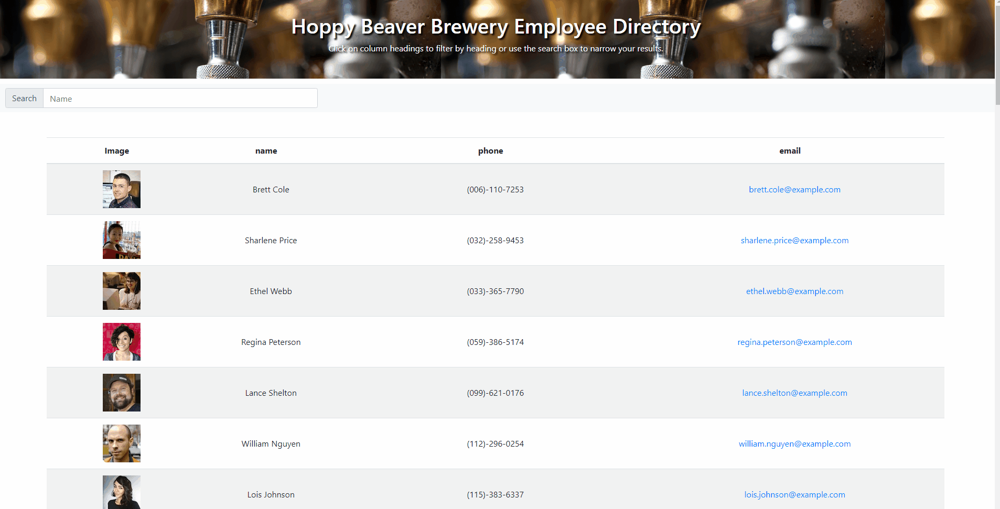

# Hoppy Beaver Employee Directory
This repository ("employee-directory") is an application that gives business management the option to view the complete list of employeees. Additionally, it allows management to search by first name to find a specific employee. This web application could be very useful at a larger company with many employees. 

## Installation

The application is deployed using github and aws amplify. The main page can be opened in the browser. The user will be presented with a database of employees, and will then have search functionality. 

## User Story
**As a** manager of a large company\
**I want** to be able to view specific employees\
**So that** I can access their emails easily  

## Built With
[React.js](https://reactjs.org/docs/getting-started.html) -Backend development language\
[Bootstrap](https://getbootstrap.com/docs/4.1/getting-started/introduction/) -Page rendering template\
[JavaScript](https://developer.mozilla.org/en-US/docs/Web/JavaScript) -Frontend development language and server usage\
[AWS Amplify](https://aws-amplify.github.io/docs/) -App deployment using github master branch\

